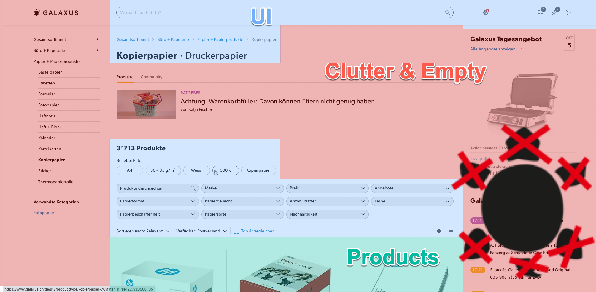

# galax~~us~~me
__because clutter sucks__

This Extension makes Galaxus way mor enjoyable to shop.

## How To Use

1. Close all Galaxus Tabs
2. Clone Repository `git clone https://github.com/blemli/galaxme`
3. Install in Chrome: [Load Unpacked Extension](https://developer.chrome.com/docs/extensions/mv3/getstarted/development-basics/#load-unpacked)
4. Pin it to Toolbar and turn it on
5. Visit https://galaxus.com

## Features

- [x] Order Page as Homepage
- [x] Works on all Languages
- [x] Toggle to disable
- [x] Hide:
    - [x] Galaxus Live
    - [x] Daily offer
    - [x] Left Navigation
    - [x] Language Toggle
    - [x] Footer
- [x] Auto select Searchbox on order page
- [ ] Use the whole Screen

## Ideas
- [ ] Publish In Chrome-Store
- [ ] Show single price instead of volume discounted price
- [ ] Show label "bought" for bought articles
- [ ] Ignore Availabilities from certain stores
- [ ] Add Shortcuts
    - [ ] Select Searchbox with Shortcut (e.g. `/`)
    - [ ] Add Shortcut to open cart (e.g. `c`)
    - [ ] Add Shortcut to open bills (e.g. `b`)
    - [ ] Add Shortcut to open orders (e.g. `o`)
    - [ ] Add Shortcut to open account (e.g. `a`)
    - [ ] Add Shortcut to open wishlist (e.g. `w`)
    - [ ] Add Shortcut to open settings (e.g. `s`)
- [ ] Always show all Filters
- [ ] Add Order link in main navigation
- [ ] Add Bills Link in main navigation
- [ ] Exclude offers from certain vendors
